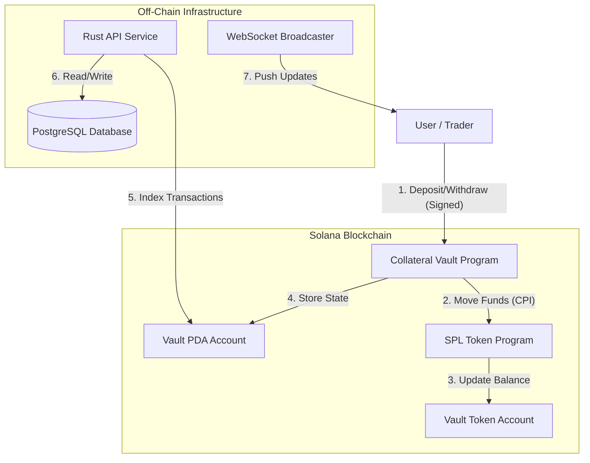

# GoQuant Collateral Vault System
> **Technical Specification & Implementation Guide**
> **Version:** 1.0.0
> **Date:** January 2026

---

## 1. Executive Summary
The **GoQuant Collateral Vault Management System** is a decentralized, non-custodial custody solution designed for high-performance perpetual futures exchanges on Solana. It enables users to securely deposit collateral into program-controlled vaults, supports real-time balance tracking via WebSockets, and ensures atomic settlement through Cross-Program Invocations (CPI).

This system solves the problem of "centralized custody" by using **Program Derived Addresses (PDAs)** to ensure that funds can only be moved by verified program logic, not by the exchange operators.

---

## 2. System Architecture

### 2.1 High-Level Overview
The system is composed of three distinct layers:
1.  **On-Chain Layer**: Solana Smart Contract (Anchor) handling assets and permissions.
2.  **Service Layer**: High-performance Rust backend (Actix) for indexing and real-time broadcasting.
3.  **Persistence Layer**: PostgreSQL database for immutable transaction history.

### 2.2 Architecture Diagram


---

## 3. Smart Contract Specification

**Path:** `anchor-program/programs/collateral_vault/src/lib.rs`

### 3.1 Account Structures
#### `Vault`
The primary state account for a user.
| Field | Type | Description |
|-------|------|-------------|
| `owner` | `Pubkey` | The wallet address of the user who owns funds. |
| `total_collateral` | `u64` | Total funds deposited (Available + Locked). |
| `locked_collateral` | `u64` | Funds locked for open positions (cannot be withdrawn). |
| `bump` | `u8` | PDA bump seed for signature verification. |

### 3.2 PDA Derivation
All vaults are Program Derived Addresses to ensure deterministic addressing and program-only control.
> **Formula:** `find_program_address([b"vault", owner.key()], program_id)`

### 3.3 Instructions
| Instruction | Arguments | Description |
|-------------|-----------|-------------|
| `initialize` | `bump: u8` | Creates the vault account. Payer: User. |
| `deposit` | `amount: u64` | Transfers tokens User → Vault. Emits `DepositEvent`. |
| `withdraw` | `amount: u64` | Transfers tokens Vault → User. Signer: PDA. |
| `lock_collateral` | `amount: u64` | Increases `locked_collateral`. Fails if insufficient funds. |
| `unlock_collateral` | `amount: u64` | Decreases `locked_collateral`. |

### 3.4 Security Measures
1.  **CPI Signers**: Withdrawals use `CpiContext::new_with_signer` with vault seeds. This ensures *only* this program can authorize a withdrawal.
2.  **Overflow Protection**: All arithmetic uses `.checked_add()` and `.checked_sub()` to prevent integer overflow attacks.
3.  **Owner Validation**: The `#[account(signer)]` constraint ensures only the owner can initiate withdrawals.

---

## 4. Backend Service & API

**Path:** `backend-service/vault-manager/`
**Framework:** Rust / Actix-Web
**Database:** SQLx / PostgreSQL

### 4.1 REST API Reference

| Method | Endpoint | Description |
|--------|----------|-------------|
| `POST` | `/vaults` | Register a new vault for tracking. |
| `GET` | `/vaults/{pubkey}` | Retrieve vault details and balance. |
| `POST` | `/vaults/deposit` | Log a deposit event (triggers WebSocket). |
| `POST` | `/vaults/withdraw` | Log a withdrawal event (triggers WebSocket). |
| `GET` | `/tvl` | Get Total Value Locked across all vaults. |

### 4.2 Real-Time WebSockets
**Endpoint:** `ws://localhost:8080/ws`

The server pushes JSON events immediately when state changes:

```json
{
  "type": "deposit",
  "vault_pubkey": "...",
  "amount": 1000,
  "new_balance": 5000,
  "timestamp": 1234567890
}
```

### 4.3 Database Schema (Postgres)
```sql
CREATE TABLE vaults (
    id SERIAL PRIMARY KEY,
    owner TEXT NOT NULL,
    pubkey TEXT NOT NULL UNIQUE,
    balance BIGINT DEFAULT 0,
    status TEXT DEFAULT 'active'
);

CREATE TABLE transactions (
    id SERIAL PRIMARY KEY,
    vault_pubkey TEXT NOT NULL REFERENCES vaults(pubkey),
    tx_type TEXT NOT NULL, -- 'deposit', 'withdraw'
    amount BIGINT NOT NULL,
    signature TEXT NOT NULL,
    timestamp BIGINT NOT NULL
);
```

---

## 5. Development & Deployment

### 5.1 Prerequisites
-   Rust (1.75+)
-   Solana CLI (1.18+)
-   Anchor CLI (0.30+)
-   PostgreSQL

### 5.2 Build Steps
1.  **Build Contract**:
    ```bash
    cd anchor-program/collateral_vault
    anchor build
    ```
2.  **Run Tests**:
    ```bash
    cargo test --test unit_tests
    ```
3.  **Start Backend**:
    ```bash
    cd backend-service/vault-manager
    # Ensure DATABASE_URL is set in .env
    cargo run
    ```

---

## 6. Testing Strategy
-   **Unit Tests**: `tests/unit_tests.rs` validates arithmetic and locking logic.
-   **Integration Tests**: `tests/anchor.test.ts` simulates full user flows on LocalValidator.
-   **End-to-End**: The `demo-client` provides a full simulation of the deposit/withdraw loop with real-time verification.

---

## 7. Related Documentation
For deeper dives into specific components, please refer to:
-   [**Security Analysis**](./SECURITY_ANALYSIS.md) - Detailed threat model.
-   [**Deployment Guide**](./DEPLOYMENT.md) - Steps for Devnet/Mainnet.
-   [**SPL Token Integration**](./SPL_TOKEN_INTEGRATION.md) - CPI specifics.
