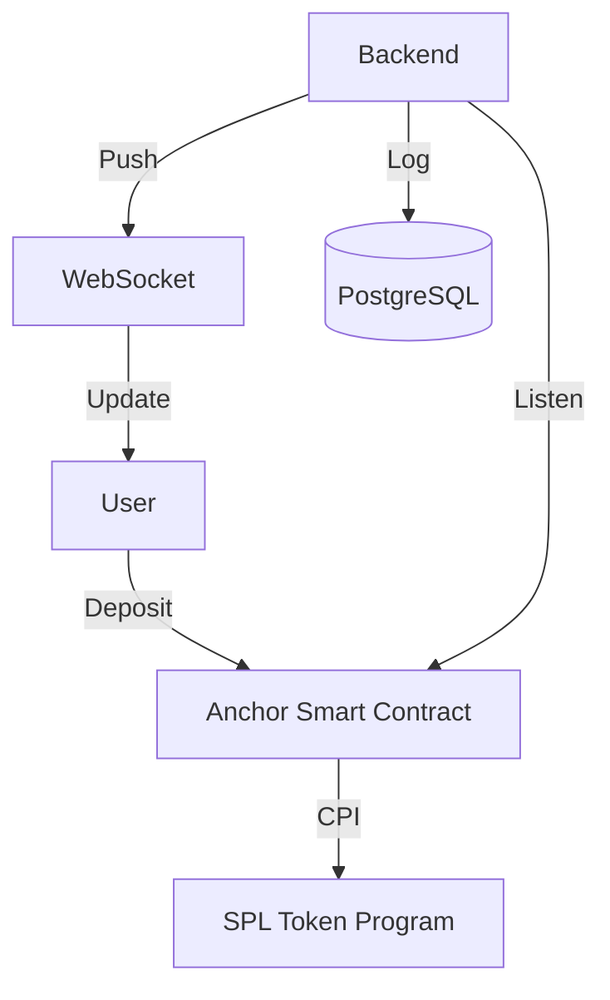

# GoQuant Collateral Vault System
## Technical Demonstration
**Date:** January 2026

---

# 1. Introduction

**The GoQuant Collateral Vault Management System**
A high-performance, decentralized custody layer for perpetual futures exchanges.

**Key Features:**
- **Secure**: Funds held in Program Derived Addresses (PDAs).
- **Non-Custodial**: Program logic controls funds, not humans.
- **Reactive**: Real-time WebSocket updates (No polling).
- **Auditable**: Immutable PostgreSQL transaction history.

---

# 2. System Architecture



**Three Pillars:**
1.  **Solana Smart Contract** (Anchor): The Authority.
2.  **Rust Backend** (Actix-Web): The Indexer & Broadcaster.
3.  **PostgreSQL**: The Audit Trail.

---

# 3. Code Walkthrough: Smart Contract
**File:** `anchor-program/programs/collateral_vault/src/lib.rs`

### **A. Initialize Vault**
```rust
// Creates a unique vault for each user
// Seeds: [b"vault", owner.key]
pub fn initialize(ctx: Context<Initialize>, bump: u8) -> Result<()> { ... }
```
- Guarantees `one user = one vault`.

### **B. Deposit (CPI)**
- Performs **Cross-Program Invocation** to SPL Token Program.
- Moves actual assets from User Wallet → Vault PDA.

---

# 3. Code Walkthrough: Smart Contract (Cont.)

### **C. Withdraw (The Critical Security)**
```rust
// Program signs for the Vault PDA using seeds
let seeds = &[b"vault", owner.key.as_ref(), &[bump]];
let signer = &[&seeds[..]];

// CPI with Signer
token::transfer(cpi_ctx.with_signer(signer), amount)?;
```
- **Security**: The User *cannot* withdraw directly. Only the **Program** can authorize it after checking `locked_collateral`.

---

# 4. Code Walkthrough: Backend
**File:** `backend-service/vault-manager/src/main.rs`

### **Actix-Web & WebSockets**
```rust
// Starts the WebSocket Broadcaster Actor
let broadcaster = Broadcaster::new().start();

// Registers the /ws route to upgrade connections
.route("/ws", web::get().to(api::websocket_handler))
```
- **Async Actor Model**: Handles thousands of concurrent connections efficiently.
- **State Injection**: Database Pool & Broadcaster are injected into every request handler.

---

# 5. Database Implementation
**File:** `backend-service/vault-manager/src/db.rs`

We use **PostgreSQL** for a robust audit trail.

```rust
// Transaction Schema
pub struct Transaction {
    pub vault_pubkey: String,
    pub tx_type: String, // 'deposit' or 'withdraw'
    pub amount: i64,
    pub signature: String,
    pub timestamp: i64,
}
```
- Every on-chain event is indexed here.
- Allows for fast history lookup and "Total Value Locked" (TVL) calculation.

---

# 6. Security Verification (Unit Tests)
Before deployment, we verify our logic.

**Command:**
```bash
cd anchor-program/collateral_vault/programs/collateral_vault
cargo test --test unit_tests
```

**Checks Performed:**
- ✅ Overflow Protection (Checked Arithmetic).
- ✅ Access Control (Owner validation).
- ✅ Locking Logic (Cannot withdraw locked funds).

---

# 7. Live Demonstration: Setup

**Step 1: Start Backend**
```bash
cd backend-service/vault-manager
cargo run
```
*Server connects to Postgres & starts listening on port 8080.*

**Step 2: Run Demo Client**
```bash
cd backend-service/demo-client
node test_demo.js
```
*Simulates a frontend user connecting via WebSocket.*

---

# 8. Live Demonstration: The Flow

**Watch the Terminal:**

1.  **Connect**: Client establishes WebSocket link.
2.  **Deposit (1000 USDT)**:
    - sent via REST API.
    - **Boom!** Instant WebSocket alert received on client.
3.  **Withdraw (200 USDT)**:
    - **Boom!** Instant balance update received.
4.  **Audit**:
    - Client fetches history from Postgres.
    - Client verifies TVL matches on-chain state.

---

# 9. Conclusion

**The GoQuant System delivers:**

| Requirement | Implementation |
|-------------|----------------|
| **Trustless** | PDA-based Vaults |
| **Performance** | Rust Backend + WebSockets |
| **Safety** | Atomic CPIs + Postgres Audit |

**Ready for Deployment.**
Thank you.
