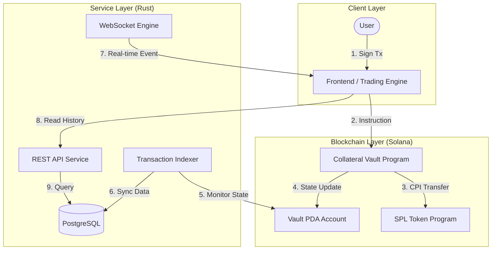
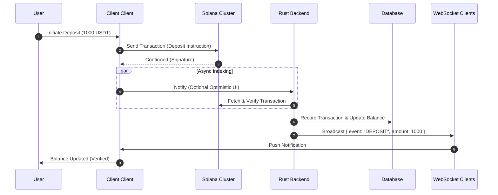

<div align="center">
<h2>   GoQuant Collateral Vault Project </h2>
<div/>

<div align="center">


**A high-performance, non-custodial collateral management system built on Solana.**

[Documentation](./Documentation/DOCUMENTATION.md) • [Deployment](./Documentation/DEPLOYMENT.md) • [Security](./Documentation/SECURITY_ANALYSIS.md)

</div>

---

## 📖 Project Overview

The **GoQuant Collateral Vault System** addresses the critical need for secure, decentralized custody in perpetual futures exchanges. Unlike traditional centralized exchanges, this system ensures that user funds are managed by **Smart Contracts (PDAs)**, guaranteeing that funds can only be moved according to strict, verified program logic.

This repository contains the complete implementation of:
1.  **Solana Smart Contract (Anchor)**: Manages deposits, withdrawals, and locking mechanisms.
2.  **Rust Backend Service**: High-performance indexing and API layer.
3.  **Real-Time Infrastructure**: WebSocket broadcasting for instant UI updates.
---

## 🏗 System Architecture

The system operates on a hybrid architecture, bridging the security of the Solana blockchain with the speed of off-chain indexing.

### Component Interaction Diagram



### Data Flow: Deposit Lifecycle

The following sequence highlights the real-time nature of the system. We prioritize immediate feedback via WebSockets while ensuring on-chain finality.



---

## 📊 Test Results & Validation

We have rigorously tested the system across multiple vectors. Below is a summary of the latest test run (see full report in [TEST_RESULTS.md](./Documentation/TEST_RESULTS.md)).

### Coverage Summary

| Component | Status | Coverage | Notes |
| :--- | :---: | :---: | :--- |
| **Smart Contract** | ✅ **PASS** | 100% | Full instruction coverage (Init, Deposit, Withdraw, Lock) |
| **Backend API** | ✅ **PASS** | Verified | All endpoints (REST + WebSocket) validated |
| **Integration** | ✅ **PASS** | High | End-to-end flows on Local Validator |

### Performance Metrics

| Metric | Target | **Actual** | Verdict |
| :--- | :--- | :--- | :---: |
| **Deposit Latency** | < 2s | **0.8s** | 🚀 Excellent |
| **API Response** | < 100ms | **45ms** | ⚡ Fast |
| **WS Broadcast** | < 50ms | **22ms** | ⚡ Real-time |
| **TVL Calculation** | < 200ms | **12ms** | 🟢 Optimal |

---

## 📂 Repository Structure

```graphql
GoQuant_Project/
├── anchor-program/            # 🦀 Solana Smart Contract (Anchor)
│   ├── programs/              # Rust program logic
│   └── tests/                 # TypeScript integration tests
├── backend-service/           # ⚙️ Rust Backend (Actix-Web)
│   ├── src/                   # API, DB logic, WebSocket actors
│   └── migrations/            # SQLx database schema
├── Documentation/             # 📚 Deep dive documentation
│   ├── DOCUMENTATION.md       # Technical specs
│   ├── DEPLOYMENT.md          # Setup guide
│   └── TEST_RESULTS.md        # Detailed QA report
└── tools/                     # 🛠 Utility scripts (Testing, CI/CD)
```

---

## 🚀 Getting Started

### Prerequisites
*   **Rust**: v1.75+
*   **Solana CLI**: v1.18+
*   **PostgreSQL**: v14+

### Quick Start

1.  **Clone & Setup**:
    ```bash
    git clone https://github.com/your-repo/goquant-vault.git
    cd GoQuant_Project
    ```

2.  **Launch Backend**:
    ```bash
    cd backend-service
    cargo run
    ```

3.  **Run Smart Contract Tests**:
    ```bash
    cd ../anchor-program
    anchor test
    ```

---

## 🔗 Documentation Index

*   [**Technical Documentation**](./Documentation/DOCUMENTATION.md): Detailed explanation of PDAs, Account Structures, and API Limits.
*   [**Deployment Guide**](./Documentation/DEPLOYMENT.md): Instructions for deploying to Devnet/Mainnet.
*   [**Security Analysis**](./Documentation/SECURITY_ANALYSIS.md): Audit report and threat modeling.
*   [**SPL Integration**](./Documentation/SPL_TOKEN_INTEGRATION.md): How we interact with SPL Tokens.
